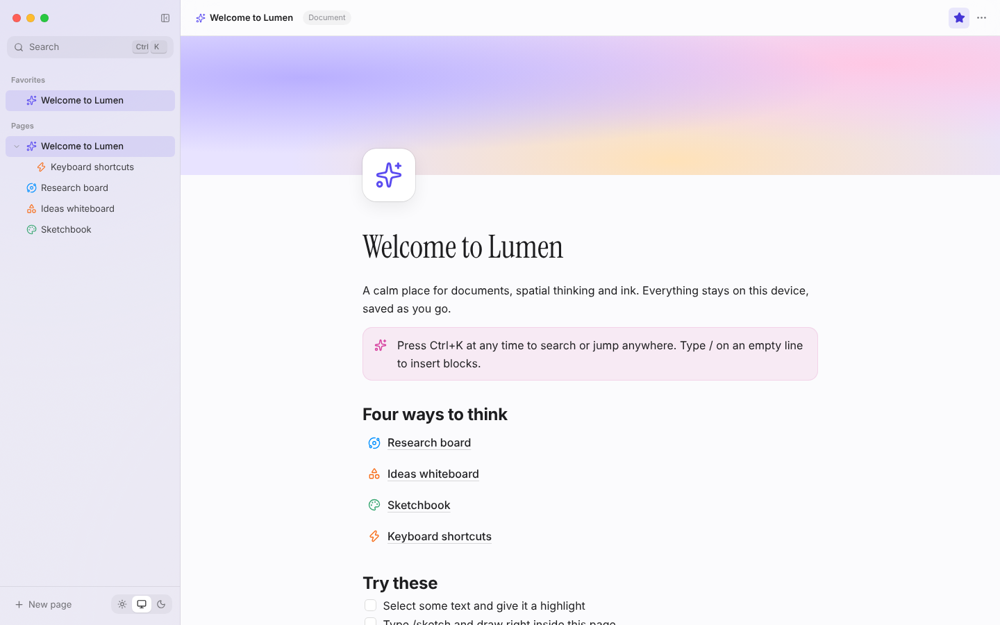

# Lumen

**A calm, Mac-inspired workspace for documents, spatial thinking and ink.**

Lumen combines four ways of thinking in one local-first app:

| | |
|---|---|
| **Documents** — a Notion-style block editor with slash commands, a formatting toolbar, callouts, to-dos, code, images, sub-pages, and handwriting and voice memos inline. | **Spatial space** — an infinite canvas where sticky notes, *live* page previews, sketches, images and frames sit side by side, joined by connectors. |
| **Whiteboard** — pressure-sensitive ink plus shapes, arrows and text, Freeform-style. | **Notebook** — Samsung Notes-style paper (lined, grid, dotted, Cornell, music) with five pen types, lasso, eraser and draw-and-hold shape snapping. |



<table>
<tr>
<td></td>
<td></td>
</tr>
<tr>
<td></td>
<td></td>
</tr>
</table>

## Highlights

- **Mac-native feel** — tinted-glass sidebar over a soft aurora, traffic-light window controls, SF typography, springy motion and a full dark mode ("graphite glass").
- **Blur-into-focus motion** — menus, popovers, pages and toasts materialise from a soft blur the way macOS and iOS do; light/dark cross-fades through a blurred view transition.
- **Block editor** — `/` slash menu, Markdown shortcuts, floating formatting HUD, highlights in five colours, callouts, syntax-highlighted code, task lists, images (paste/drop), live sub-page links.
- **Ink everywhere** — fountain pen, ballpoint, pencil (with grain), marker and highlighter; per-pen colour and size memory; stroke eraser; lasso to move, recolour and duplicate; **draw-and-hold** to snap to a perfect line, rectangle or ellipse; palm rejection once a stylus is detected.
- **Voice memos** — record straight into a note with a live waveform; scrub and play back at 1×, 1.5× or 2×.
- **Spatial canvas** — pan, pinch and zoom-at-cursor; marquee selection; frames that carry their contents; connectors; minimap; semantic zoom; drag pages in from the sidebar.
- **Ctrl+K command palette** — fuzzy search across titles *and* body text, plus every app action.
- **Local-first** — everything is stored in IndexedDB on your device. Export Markdown, SVG, PNG, or a full JSON backup.

## Getting started

```bash
npm install
npm run dev        # http://localhost:5173
npm run build      # type-check + production build into dist/
npm run preview    # serve the production build
```

Requires Node 20+. On first launch Lumen creates a short guided tour.

## Tech stack

| Concern | Choice | Why |
|---|---|---|
| Build | [Vite](https://vite.dev) | instant dev server, code splitting out of the box |
| UI | React 19 + TypeScript (strict) | components + types that document the data model |
| State | [zustand](https://zustand.docs.pmnd.rs) + immer | tiny, selector-based, works outside React |
| Persistence | IndexedDB via [idb-keyval](https://github.com/jakearchibald/idb-keyval) | async, large quota, stores Blobs natively |
| Rich text | [TipTap](https://tiptap.dev) (ProseMirror) | schema-based documents, custom React node views |
| Ink | [perfect-freehand](https://github.com/steveruizok/perfect-freehand) | pressure-sensitive stroke outlines |
| Motion | [framer-motion](https://motion.dev) | springs, layout and shared-layout animations |
| Icons | [lucide](https://lucide.dev) | consistent 1.8px line icons |

No backend, no UI kit — every component and style is hand-written against a small set of design tokens.

## Project structure

```
src/
  App.tsx                 app root: hydration, theme, shortcuts, seed
  styles/                 design tokens + global base styles
  store/                  data model, zustand store, IndexedDB adapter, seed
  lib/                    framework-free helpers (motion presets, text, images, export)
  hooks/                  reusable hooks (theme, history, shortcuts…)
  components/
    shell/                window chrome: sidebar frame, titlebar, traffic lights
    sidebar/              page tree, favourites, trash
    ui/                   primitives: IconButton, Menu, Popover, Toast, Kbd, PageIcon
  features/
    home/                 the home screen
    page/                 page router, header (cover, icon, title)
    doc/ + editor/        the block editor and its extensions
    ink/                  the shared ink engine (pens, geometry, capture, toolbar)
    notebook/             paged paper notebooks
    canvas/               shared camera + canvas chrome
    space/                the spatial document space
    board/                the whiteboard
    command/              Ctrl+K palette
docs/                     the learning guide (start at docs/README.md)
```

## Learn how it's built

The [`docs/`](docs/README.md) folder is a guided tour of the codebase. Each
chapter explains a feature, the concepts behind it (camera math, Bézier
smoothing, ray casting, springs, ProseMirror schemas…), and points to the
exact files that implement it. Start with
[01 · Architecture](docs/01-architecture.md).

The visual design was explored first on a **design canvas** (concept & tokens,
document editor, spatial space, ink notebook) — see
[02 · Design system](docs/02-design-system.md).

## Keyboard shortcuts

Lumen follows **Windows keyboard conventions**: Ctrl is the command key,
Ctrl+Y redoes and F2 renames. On a Mac, ⌘ is accepted wherever Ctrl is listed.

| | |
|---|---|
| `Ctrl+K` / `Ctrl+P` | command palette |
| `Alt+N` | new document (browsers reserve `Ctrl+N`) |
| `F2` | rename the current page |
| `Ctrl+\` | toggle sidebar |
| `Ctrl+Shift+L` | toggle light / dark |
| `Delete` | move the focused sidebar page to the trash |
| `/` | block menu (in documents) |
| `Space`-drag, pinch, `Ctrl`+scroll | pan & zoom canvases |
| `Ctrl+0` / `Ctrl+1` | 100% / zoom to fit |
| `Ctrl+A` / `Ctrl+D` / `Delete` | select all / duplicate / delete on canvases |
| `V H N T F S` | space tools |
| `V H P E R O D A T` | whiteboard tools |
| `Ctrl+Z` / `Ctrl+Y` | undo / redo (`Ctrl+Shift+Z` works too) |
