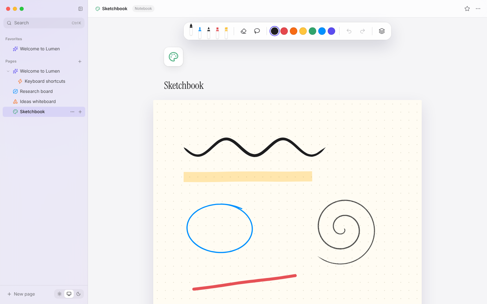

# 06 · Notebooks

## What you see

A stack of A4 sheets, Samsung Notes style. Pick a template (plain, lined,
grid, dotted, Cornell, music staff) and a paper colour (white, ivory, mint,
night), write with the pen case, add or delete pages, undo across the whole
notebook.



## Concepts

### Stable "paper units" with viewBox

A sheet is an `<svg viewBox="0 0 794 1123">` — A4 at 96 dpi. The SVG scales to
whatever width the screen allows, but strokes are always stored in those
794 × 1123 units. Draw on a laptop, open on a phone: identical.

Converting a pointer position to paper units (`InkSurface.tsx`):

```ts
const r = svg.getBoundingClientRect();
x = (clientX - r.left) / r.width  * 794;
y = (clientY - r.top)  / r.height * 1123;
```

Because it uses the *rendered* rectangle, the same code keeps working inside a
zoomed canvas (sketch cards in the spatial space) — `getBoundingClientRect`
already includes every CSS transform.

### Paper as SVG patterns

`src/features/notebook/paper.tsx` draws templates with `<pattern>`: define one
tile, fill a rectangle with it, and SVG repeats it.

```svg
<pattern id="lined" width="794" height="32" patternUnits="userSpaceOnUse">
  <line x1="0" x2="794" y1="31.5" y2="31.5" stroke="…"/>
</pattern>
<rect y="96" width="794" height="1027" fill="url(#lined)"/>
```

* Grid = a 24×24 tile with lines on two edges.
* Dotted = a 24×24 tile with one circle.
* Cornell = lined pattern plus a cue column, notes area and summary band.
* Music = five staff lines every 120 units.

Because paper lives in the same SVG as the ink, the paper picker's
thumbnails are just the same component at a small size.

Each sheet sets `--ink-black` from its tint, so black ink stays dark on ivory
paper even in dark mode and turns light on "night" paper.

### Notebook-wide undo

Each sheet is its own `InkSurface`, but ⌘Z should undo your *last action*
wherever it happened. `NotebookPage` therefore keeps one history of the whole
`sheets` array: every commit from any sheet records a snapshot of all sheets
first (once per gesture, using the same `lastBefore` trick as chapter 05).
Adding or deleting a page is recorded too.

## In the code

| File | Role |
|---|---|
| `features/notebook/paper.tsx` | templates, tints, sheet size |
| `features/notebook/NotebookPage.tsx` | sheets, history, paper picker |
| `features/notebook/Notebook.css` | page stack and picker styles |

## Try it

1. Add a **"planner"** template: seven labelled day rows.
2. Add page thumbnails in a side rail that scroll to the clicked sheet
   (render each sheet's strokes into a small `<svg>` with the same viewBox).
