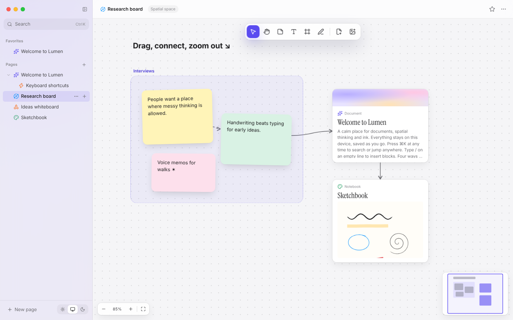

# 08 · The spatial space

## What you see

An infinite canvas for arranging thoughts: tilted sticky notes in six
colours, big text labels, **frames** that group cards, sketch cards you can
draw in, images, and **live page cards** — a window onto any document or
notebook that updates as you edit it. Drag from a card's handle to connect it
to another; a minimap shows where you are.



## Concepts

### Controller and views

`SpacePage.tsx` is the **controller**: it owns the tool, the selection, the
in-progress gesture and every write to the store. `SpaceCard.tsx` renders
**dumb views** that only report events upward through a `handlers` object.

Why? Gestures like "drag three selected cards plus everything inside the
selected frame" need to know about *all* cards — logic that doesn't belong in
any single card. And because cards are wrapped in `memo` and receive *stable*
handlers (created once with `useMemo`, reading fresh values from a ref),
moving one card doesn't re-render the others.

### Gestures as a tiny state machine

A pointer-down starts one gesture; moves update it; pointer-up finishes it.

```
pointerdown on background ──▶ marquee     ─▶ select cards touching the box
pointerdown on card       ──▶ move        ─▶ translate selection (+ frame contents)
pointerdown on corner     ──▶ resize
pointerdown on handle     ──▶ connect     ─▶ on release over a card: add edge
```

The gesture stores the **origin** positions at its start. Each move sets
`position = origin + (pointer − start)` — computing from the origin instead
of adding deltas avoids accumulating rounding errors.

A move is only recorded in undo history once the pointer has travelled 3
screen pixels, so a simple click doesn't create an empty undo step.

### Frames

A frame is just a card of type `'frame'` that renders behind everything. When
a drag starts on a frame, every card fully **contained** in its rectangle
joins the move. No parent/child pointers to keep in sync — containment is
computed from geometry at the moment it matters.

### Connectors

`spaceModel.ts` + `Edges.tsx`

An edge stores only `{ from, to }`. To draw it:

1. Find where the line between the two card centres **leaves each card's
   border** — a ray/rectangle intersection: the ray exits a vertical side at
   `t = (w/2)/|dx|` and a horizontal side at `t = (h/2)/|dy|`; the smaller `t`
   wins.
2. Join the two border points with a **cubic Bézier** whose control points
   extend along the dominant axis — horizontal cards get a gentle S, stacked
   cards a vertical one.

All edges live in one SVG, 1×1 px with `overflow: visible`, so it never needs
resizing. Each edge is drawn twice: a fat transparent path for easy clicking
and the thin visible line.

### Live page cards

A page card stores a `pageId` and subscribes to that page. The preview shows
the cover, title, a text snippet (`docToText`) or — for notebooks — the first
sheet's real strokes. Double-click opens the page.

### Drag and drop, paste

* Sidebar rows put the page id in `dataTransfer` under a custom MIME type
  (`application/x-lumen-page`); the canvas checks for it on `dragover` and
  creates a page card on `drop`.
* Image files dropped from the desktop, or pasted, become image cards
  (downscaled first).
* Pasted text becomes a sticky note.

### The minimap

Cards and the current view rectangle are scaled by **one** factor so their
union fits 184×120 px. Clicking or dragging in the minimap converts back to
world coordinates and centres the camera there.

## In the code

| File | Role |
|---|---|
| `features/space/SpacePage.tsx` | controller: tools, gestures, keyboard, drop, paste, undo |
| `features/space/SpaceCard.tsx` | card views + live page preview |
| `features/space/spaceModel.ts` | card factory, rect helpers, connector geometry |
| `features/space/Edges.tsx` | connectors |
| `features/space/Minimap.tsx` | overview |

## Try it

1. Let users label edges: double-click an edge to edit `edge.label` and render
   it at the curve's midpoint (for a cubic Bézier, `t = 0.5`).
2. Snap cards to the 24-unit grid while dragging with ⌥ held.
3. Add an "auto-arrange" command that lays selected cards out in a grid.
