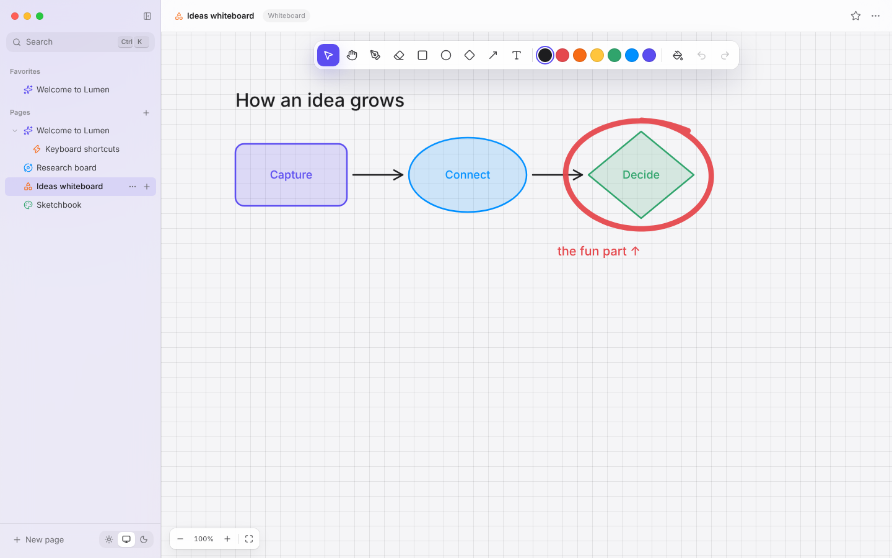

# 09 · The whiteboard

## What you see

A Freeform/Excalidraw-style board: draw with any pen, add rectangles,
ellipses and diamonds (with labels), arrows with draggable ends, and text.
Select with a click or a marquee, recolour, fill, resize, duplicate, erase,
undo — and export to PNG or SVG.



## Concepts

### A discriminated union of elements

```ts
type BoardElement =
  | { type: 'stroke'; stroke: Stroke }
  | { type: 'shape'; shape: 'rect' | 'ellipse' | 'diamond'; x; y; w; h; color; fill; text? }
  | { type: 'arrow'; x1; y1; x2; y2; color }
  | { type: 'text';  x; y; text; color; size };
```

The `type` field *discriminates* the union: inside `switch (el.type)`,
TypeScript knows exactly which fields exist. `boardModel.ts` gives every
element the same three abilities — `elementBounds`, `hitElement`,
`translateElement` — so tools (select, erase, move, marquee, export) handle
all elements uniformly. Add a new element type and the compiler lists every
switch that needs a new case.

A related trick from `seed.ts`: `Omit<BoardElement, 'id'>` collapses the
union to only the keys *all* members share. To omit from each member you need
a **distributive conditional type**:

```ts
type NoId<T> = T extends unknown ? Omit<T, 'id'> : never;
```

### Event delegation

Instead of attaching handlers to hundreds of SVG elements, the viewport has
one `onPointerDown`. Each element's `<g>` carries `data-el={id}`, and we find
the target with `event.target.closest('[data-el]')`. Fewer listeners, and new
elements need no wiring.

### The pointer-capture pitfall

During a gesture we call `setPointerCapture` on the viewport so it keeps
receiving moves. Side effect: the browser then **retargets** the following
`click`/`dblclick` events to the capturing element — `event.target` is the
viewport, not the shape you double-clicked!

So double-click hit-tests **geometrically**: convert the pointer to world
coordinates and search the elements from last to first (later = drawn on
top) with `hitElement`.

A second focus pitfall: creating a text box on `pointerdown` and focusing its
textarea fails, because the browser's default `mousedown` action then moves
focus to `<body>`. Calling `preventDefault()` on that pointerdown fixes it.

### Constant-size selection chrome

Selection boxes and handles live in world space (so they follow elements),
but they should look the same size at any zoom. Dividing their dimensions by
the zoom keeps them constant on screen:

```tsx
<rect width={12 / z} height={12 / z} strokeWidth={2 / z} />
```

### Drawing shapes

While dragging, a `draft` element is rendered but not stored. On release it
is normalised (negative width/height from dragging up-left become positive),
committed as one undo step, and selected. Holding Shift constrains to a square or
circle.

### Arrowheads by hand

SVG `<marker>` content can't inherit the colour of the line using it in every
browser. So arrowheads are drawn directly: two short lines at ±0.5 rad from
the shaft angle `atan2(dy, dx)`.

## In the code

| File | Role |
|---|---|
| `features/board/boardModel.ts` | bounds, hit-testing, translation, diamond path |
| `features/board/BoardPage.tsx` | tools, gestures, rendering, text editing |
| `lib/export/inkSvg.ts` | `boardSvg` for SVG/PNG export |

## Try it

1. Add a **line** tool (an arrow without a head).
2. Make arrows **bind** to shapes: store `fromId/toId` and recompute endpoints
   from the shapes' borders, as the spatial space does for connectors.
3. Add a "sloppiness" option that draws shapes with slightly wobbly paths
   (hint: run the shape's outline through perfect-freehand with a little noise).
