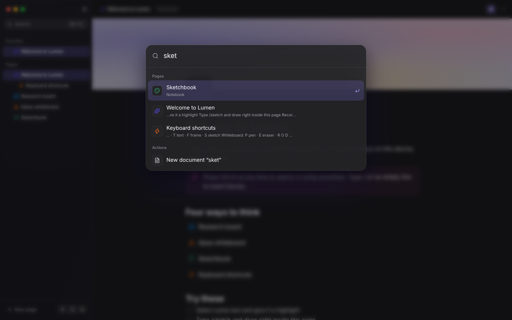

# 11 · Commands & shortcuts

## What you see

Press **⌘K** anywhere: a glass panel drops in, you type a few letters, and it
finds pages by title *or* by words inside them (with a snippet), plus actions
like "New whiteboard", "Switch to dark appearance" or "Export workspace
backup". Arrow keys move a sliding highlight; Enter runs it.



## Concepts

### A search index built on open

When the palette opens, it builds a list of `{ page, title, text }` where
`text` is the document's plain text from `docToText()` (`src/lib/text.ts`), a
recursive walk that concatenates every text leaf of the ProseMirror JSON.
`useMemo` keeps that index until the pages change.

### Fuzzy matching

`fuzzyScore(text, query)` asks: do the query's characters appear **in order**?
Then it rewards the matches people mean:

* +3 for a match at the **start of a word** (`wb` → **W**hite**b**oard),
* +2 per character of a **consecutive** run,
* a big bonus for a plain substring, bigger for a prefix.

Body-text matches score lower than title matches and show a snippet around
the hit. Page results come first, then actions.

### Keyboard-first lists

The input keeps focus the whole time; ↑/↓ change an index in state and the
highlighted row is scrolled into view with `scrollIntoView({ block: 'nearest' })`.
The moving highlight is a shared-`layoutId` element (chapter 10).

### Global shortcuts

`src/hooks/useGlobalShortcuts.ts` registers **one** `keydown` listener on
`window`. It reads the store with `getState()` inside the handler instead of
subscribing, so it never needs to be re-registered.

Surface-specific shortcuts (tools on canvases, ⌘Z) are registered by each
surface and **ignore keys typed into inputs**:

```ts
if (target.closest('input, textarea, [contenteditable="true"]')) return;
```

### Platform modifiers

Mac users expect ⌘, everyone else Ctrl. `src/components/ui/Kbd.tsx` detects
Apple platforms once and exports:

* `isMod(event)` — "is the platform modifier held?"
* `<Kbd keys="Mod+K" />` — renders `⌘K` or `Ctrl K`.

Some shortcuts are reserved by browsers (⌘N opens a window), so ⌥N is offered
as a fallback for "new document".

## Try it

1. Add a `>` prefix mode that shows only actions (like VS Code).
2. Add recent-search memory: show the last five opened pages when the query is
   empty (hint: store ids in the workspace store).
3. Add a `?` shortcut that opens a sheet listing every shortcut.
